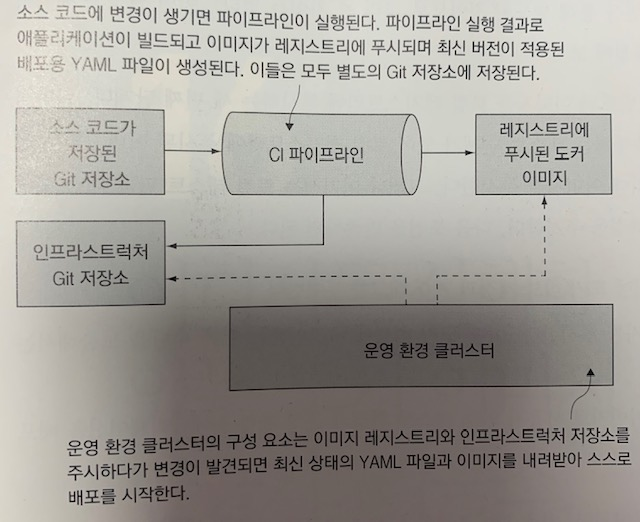

# 15장 보안 원격 접근 및 CI/CD를 위한 도커 설정

## 도커 API의 엔드포인트 형태

도커에서는 API의 형태로 도커 엔진을 이용할 수 있는데, 이는 다음과 같은 장점이 있다.

* 다른 도구로도 도커 API를 사용할 수 있어 **컨테이너를 관리하는 도구의 선택지가 넓어진다**.
* 로컬 컴퓨터에 있는 **명령행 도구로 원격 컴퓨터에서 실행 중인 도커 엔진을 관리**할 수 있다.

여기서 도커 엔진에 대한 원격 접근은 디버깅 목적으로도 사용되지만, 지속적 통합-지속적 배포 파이프라인에서 **'지속적 배포' 부분을 구성하는 데도 사용**된다.

### 비보안 HTTP로 원격에서 도커 엔진 제어하기

처음 도커를 설치하면 도커 API와 통신하기 위해 별도의 설정을 할 필요가 없는데, 리눅스 소켓 혹은 윈도의 명명 파이프가 로컬 채널로 쓰이도록 설정되어 있기 때문이다.

도커 엔진을 원격에서 접근하게 하기 위한 수단 중 비보안 HTTP를 통해 접근하는 방법이 가장 간단한 방법인데, 이렇게 되면 일반적인 HTTP 엔드포인트를 통해 API에 접근할 수 있으므로 같은 네트워크에 연결된 사람이라면 누구든지 아무 인증 절차 없이 이 도커 엔진에 접근해 컨테이너를 멋대로 다룰 수 있으므로, **암호화 되지 않은 HTTP로 접근을 허용하는 것은 반드시 피해야 한다**.


## 보안 원격 접근을 위한 도커 엔진 설정

도커에는 API가 요청을 받아들일 수 있는 채널이 로컬 채널과 비보안 HTTP 채널뿐만 아니라 보안 채널도 존재한다.

* 첫 번째 채널은 **상호 전송 계층 보안(Transport Layer Security, TLS)**으로, HTTPS 프로토콜의 디지털 인증서와 같은 암호화 방식을 사용한다.
* 두 번째 채널은 **보안 셸(Secure Shell, SSH)** 프로토콜이다.

### 상호 TLS 프로토콜

* 도커 API는 상호 TLS를 사용하므로 서버와 클라이언트가 각각 인증서를 갖는다. 서버의 인증서는 자신을 증명하고 전송되는 내용을 암호화하는 데 사용되며, 클라이언트의 인증서는 자신을 증명하는 데 사용된다.

```sh
# 인증서를 둘 디렉터리를 생성한다
mkdir -p /diamol-certs

# 인증서 및 설정값을 적용할 컨테이너를 실행한다
docker container run -v /diamol-certs:/certs -v /etc/docker:/docker diamol/pwd-tls:server

# 새로운 설정을 적용해 도커를 재시작한다
pkill dockerd
dockerd &>/docker.log &
```

* TLS는 더 널리 사용되는 방법이지만 인증서를 생성하고 교체하는 관리 업무에서 오버헤드가 발생한다.

### SSH 프로토콜

* SSH의 장점은 도커 명령행 도구가 표준 SSH 클라이언트를 사용하기 때문에 도커 엔진 쪽에서 설정을 변경할 필요가 없고 사용자 인증은 서버가 대신 처리해 주기 때문에 따로 인증서를 생성할 필요도 없다. 도커 엔진을 실행 중인 컴퓨터에서 원격 접속에 사용할 계정을 추가하기만 하면 된다.

```sh
# node1의 IP 주소를 환경 변수로 정의한다
node1ip="<node1-ip-address-goes-here>"

# 접속 테스트를 위해 SSH로 접속을 시도한다
ssh root@$node1ip
exit
```

* SSH는 사용하는 컴퓨터에 대부분 설치돼 있는 SSH 클라이언트만 있으면 되며 접근 권한 관리가 상대적으로 쉽다.

### TLS와 SSH, 무엇을 사용할까?

* 만약 리눅스 운영 경험이 많은 조직이라면 인증서 관리 부담이 적고 학습 부담이 적은 SSH에 긍정적인 반을을 나타내지만, 한편으로는 단지 도커 엔진을 원격으로 사용하기 위해 서버 접근 권한을 부여하는 것은 지나치다는 반응을 나타내기도 한다.
* 윈도 환경을 채택한 조직에서는 윈도용 OpenSSH 서버를 설치하면 똑같이 SSH를 사용할 수 있지만, 윈도 서버에 대한 접근 권한 관리는 리눅스와 큰 차이가 있다. 이 경우 인증서 관리에 따른 오버헤드를 감수하고서라도 TLS가 더 좋은 선택일 수도 있다.

### 주의사항

* TLS나 SSH 보안을 적용하면 암호화와 사용자 인증이 함께 적용된다. 다만 보안 접속에 권한 조정 기능이나 감시 기능은 포함돼 있지 않으므로, 특정 사용자에게 특정 명령의 사용 권한을 지정하거나 어떤 사용자가 어떤 작업을 했는지 추적할 수는 없다. 따라서 환경별 접근 권한이 필요해졌을 때 이러한 점을 고려해야한다.
* 도커 명령행 도구를 사용하면 접근 중인 원격 엔진을 바꾸기가 너무 쉬워서 테스트 환경의 중요한 데이터가 담긴 볼륨을 로컬 엔진의 볼륨으로 착각하고 삭제할 수도 있으므로, 사용자은 자신이 현재 어떤 환경에 접근해 있는지 주의해야 한다.


## 도커 컨텍스트를 사용해 원격 엔진에서 작업하기

`host` 의 인자값으로 지정해 도커 명령행 도구가 가리킬 원격 컴퓨터를 결정할 수 있지만, 보안 접근을 위한 TLS 인증서의 경로까지 명령을 입력할 때마다 매번 지정해야 하기 때문에 사용하기 번거롭다.

**도커 컨텍스트를 사용하면 원격으로 접근할 도커 엔진을 편리하게 전환할 수 있다**. 도커 컨텍스트는 도커 명령행 도구에서 원격 접근에 필요한 모든 상세 정보를 지정하면 생성할 수 있다. 또한 컨텍스트는 여러 개를 만들 수도 있으며 원격 접근에 필요한 상세 정보는 모두 로컬 컴퓨터에 저장된다.

```sh
# Play with Docker 내 도커 엔진의 도메인과 인증서로 컨텍스트를 생성한다.
docker context create pwd-tls --docker "host=tcp://$pwdDomain,ca=/tmp/pwd-certs/ca.pem,cert=/tmp/pwd-certs/client.pem,key=/tmp/pwd-certs/client-key.pem"

# SSH 보안을 적용한 경우
# docker context create local-tls --docker "host=ssh://user@server"

# 컨텍스트 목록을 확인한다
docker context ls
```

컨텍스트를 전환하는 방법은 두 가지다. 한 가지는 해당 터미널 세션에만 적용되는 임시적인 전환이고, 다른 한 가지는 이후 다른 컨텍스트로 다시 전환할 때까지 다른 터미널 세션에도 모두 적용되는 영구적인 전환이다.

```sh
# 환경 변수를 사용해 이름이 있는 컨텍스트로 전환하는 방법
# 해당 터미널 세션에서만 적용되지만, 권장되는 컨텍스트 전환 방법이다

export DOCKER_CONTEXT='pwd-tls'

# 현재 선택된 컨텍스트를 확인한다
docker context ls

# 현재 컨텍스트가 가리키는 도커 엔진의 컨테이너 목록을 확인한다
docker container ls

# 기본 컨텍스트로 복귀한다. 이 방법으로 컨텍스트를 전환하면 다른 터미널 세션까지 영향을 미치기 때문에 바람직하지 않다
docker context use default

# 현재 컨텍스트가 가리키는 도커 엔진의 컨테이너 목록을 확인한다
docker container ls
```

### 주의사항

* `docker context use` 명령으로 컨텍스트를 전환하면 시스템 전체에 영향이 미친다. 새 터미널 창을 열거나 도커 명령을 사용하는 모든 배치 프로세스가 이 컨텍스트를 사용한다.
* `DOKCER_CONTEXT` 환경 변수를 정의해 컨텍스트 설정을 오버라이드 할 수 있는데, 이렇게 하면 현재 터미널 세션에만 적용되므로 이 방법을 사용하는 것이 좋다.


## 지속적 통합 파이프라인에 지속적 배포 추가하기


## 도커 리소스의 접근 모델

