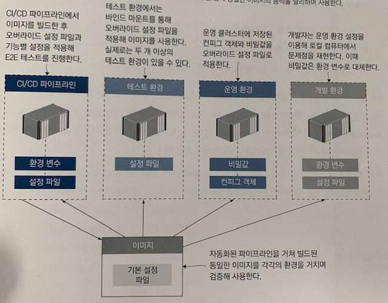

# 18장 컨테이너의 애플리케이션 설정 관리

애플리케이션은 환경에 따른 설정을 외부로부터 주입받아야 한다. 이 설정은 주로 환경 변수 또는 파일 형태를 갖는다. 도커는 컨테이너에서 실행되는 환경을 만들어 주며, 환경 변수를 설정하고 파일 시스템을 구성한다. 이들 기능을 잘 활용해 여러 곳에 분리된 설정값을 병합함으로써 환경 설정을 구성하면 된다.

## 다단 애플리케이션 설정

### 설정 모델

설정 모델은 설젱에 담긴 데이터의 구조를 반영해야 한다. 설정 데이터의 종류는 주로 다음 세 가지다.

* **버전에 따라 달라지는 설정** : 모든 환경에서 동일하지만 버전별로 달라지는 설정
* **환경에 따라 달라지는 설정** : 환경별로 달리지는 설정
* **기능 설정** : 버전별로 애플리케이션의 동작을 달리하기 위한 설정

### Node.js 예시

설정 관리 라이브러리인 `node-config` 를 사용하는 Node.js 애플리케이션 예제이다. `node-config` 는 여러 곳에 위치한 파일에서 단계별로 정의된 설정값을 읽어 들이고 병합해 설정을 구성한 다음 환경 변수로 이 설정을 오버라이드하는 방식으로 설정을 관리한다.

Node.js 애플리케이션에서는 다음 두 디렉터리에서 설정을 읽어 온다.

* **config** : 기본 설정으로 도커 이미지에 포함되는 설정
* **config-override** : 이미지에는 포함되지 않지만 볼륨, 컨피그 객체, 비밀값 등을 통해 컨테이너 파일 시스템에 주입되는 설정

```sh
# 로컬 오버라이드 설정 파일의 설정을 적용해 컨테이너를 실행
docker container run -d -p 8081:80 -v "$(pwd)/config/dev:/app/config-override" diamol/ch18-access-log
```

컨테이너는 이미지에 함께 패키징된 기본 설정 파일을 사용하는데, 로컬 디렉터리를 볼륨으로 연결해 그 안에 있는 오버라이드 설정 파일의 설정을 적용했다. 미리 정의된 경로에서 오버라이드 설정 파일을 읽어 들이도록 해 두면, 어떤 경로로든 컨테이너 파일 시스템에 설정 파일을 주입하기만 하면 해당 설정을 적용할 수 있다. 여기서는 로컬 바이드를 사용했으나 클러스터에 저장된 컨피그 객체나 비밀값을 사용해도 같은 결과를 얻을 수 있다.

```json
// 이미지에 패키징된 기본 설정 파일
{
  "release": "19.12",
  "environment": "UNKNOWN",
  "metrics": {
    "enabled": true
  }
}
```

```json
// 볼륨으로 연결할 오버라이드 설정 파일
{
  "environment": "DEV",
  "metrics": {
    "enabled": false
  }
}
```

`node-config` 패키지에는 환경 변수로부터 설정값을 불러오는 기능도 있다. 이 설정 값으로 파일 계층에서 불러온 설정값을 오버라이드할 수 있다. 이 방법은 'The Twelve-Factor App' 에서 추천하는 방법이며, 환경 변수에 포함된 설정값을 최우선 순위에 두는 현대적 애플리케이션 설계 스타일을 말한다.

```sh
# 오버라이드 설정 파일과 환경 변수로 설정을 구성해 컨테이너를 실행
docker container run -d -p 8082:80 -v "$(pwd)/config/dev:/app/config-override" -e NODE_CONFIG='{"metrics": {"enabled":"true"}}' diamol/ch18-access-log
```

위 예시는 컨테이너의 설정은 이미지에 포함된 기본 설정 파일, 볼륨으로 마운트된 로컬 디렉터리의 오버라이드 설정 파일, 환경 변수를 병합해 만들어진다. 이런 구성은 개발자의 워크플로를 부드럽게 유지할 수 있도록 하는데, 프로메테우스 정보 수집을 비활성하는 기본 설정으로 애플리케이션을 실행하다가, 디버깅을 할 일이 생기면 환경 변수 값만 수정해서 정보 수집을 따로 활성화할 수 있다.


## 환경별 설정 패키징하기

여러 가지 애플리케이션 프레임워크에서 환경별 설정 파일을 모두 배포에 포함시킬 수 있는 기능을 제공한다. 이 기능을 사용하면 애플리케이션을 실행할 때 환경 이름만 선택해도 해당 환경의 설정을 적용할 수 있다.

### 닷넷 코어 예시

닷넷 코어는 다음과 같은 두 파일로부터 기본 설정값을 읽어 들이는 방식으로 구현돼 있다.

* **appsettings.json** : 모든 환경에 공통적으로 적용되는 설정
* **appsettings.{환경_이름}.json** : 환경별로 적용되는 오버라이드 설정 파일
* **환경 변수** : 환경 이름 정의 및 오버라이드 설정

```sh
# to-do 애플리케이션을 테스트 환경 설정으로 실행
docker container run -d -p 8084:80 -e DOTNET_ENVIROMENT=Test diamol/ch18-todo-list
```

닷넷 코어에서는 환경별 설정이 이미지에 패키징되어 있어 별도의 설정을 외부에서 주입할 필요가 없다. 하지만 이렇게 하면 이미지에 포함시킬 수 없는 민감한 정보(패스워드, API 키 등) 때문에 여전히 따로 외부에서 컨테이너에 주입해야 하는 정보가 남게 된다.

```sh
# 바인드 마운트 및 환경 변수 설정을 적용해 컨테이너를 실행
docker container run -d -p 8086:80 -e DOTNET_ENVIRONMET=Production -e release=CUSTOM -v "$(pwd)/config/prod-local:/app/config-override" diamol/ch18-todo-list
```

Node.js 예제와 비슷한 방법을 사용했으므로 디렉터리명과 파일명이 비슷하다. 다만, 닷넷 코어에서는 설정을 오버라이드하는 데 환경 변수를 사용한다는 점이 다르다. `node-config` 를 사용하면 환경 변수 값으로 JSON 문자열을 지정해야 설정을 오버라이드할 수 있지만, 닷넷 코어에서는 각각의 환경 변수 형태로 설정을 오버라이드한다는 것도 차이점이다.


## 런타임에서 설정 읽어 들이기

### Go 언어 예시

Go 언어에도 바이퍼(Viper) 라는 설정 모듈이 널리 쓰인다. 바이퍼의 기능도 닷넷 코어 라이브러리나 `node-config` 와 크게 다르지 않다.

* 이미지에 포함된 `config` 디렉터리에서 기본 설정 파일을 읽어 들인다.
* 환경별 설정 파일은 `config-override` 디렉터리에서 읽어 들이는데, 이 디렉터리는 이미지에서는 빈 디렉터리이며 파일 시스템 마운트로 외부에서 주입된다.
* 환경 변수는 설정 파일의 설정값을 오버라이드할 수 있다.

바이퍼는 설정 파일 포멧의 선택 범위가 좀 더 넓다. JSON 또는 YAML 등을 사용할 수 있지만, Go 언어에서는 TOML이 널리 쓰인다. TOML은 코드에서 편리하게 디렉터리를 지정할 수 있기 때문에 JSON이나 YAML보다 가독성 면에서 뛰어나다.

TOML은 특히 클라우드 기반 프로젝트에서 널리 사용되는데, 다른 포맷에 비해 클라우드 환경에서 장점이 더 크기 때문이다. 또한, 가독성이 좋다는 점은 디버깅이 쉬우며 병합 도구를 이용해 버전별 설정의 차이를 확인하기 쉽다는 뜻이기도 하다.

```toml
release = "19.12"
environment = "UNKNOWN"

[metrics]
enabled = true

[apis]

 [apis.image]
 url = "http://iotd/image"

 [apis.access]
 url = "http://accesslog/access-log"
```

```sh
# 환경 변수를 이용한 설정 오버라이드를 적용해 컨테이너를 실행
docker container run -d -p 8088:80 -v "$(pwd)/config/dev:/app/config-override" -e IG_METRICS.ENABLED=TRUE diamol/ch18-image-gallery
```

바이퍼의 설정에 사용되는 환경 변수의 이름을 지을 때는 다른 애플리케이션 환경 변수와의 충돌을 피하기 위해 IG라는 접두사를 붙이는 관습이 있다. 여기서는 접두사 IG 뒤로 언더스코어를 추가로 붙이고, 그 뒤의 이름은 점 문법을 따른다.

### 설정 API

설정 API는 현재 설정 내용이 담긴 JSON 문자열을 반환한다. 애플리케이션에 계층별 설정을 적용했다면 설정 API 기능이 매우 유용할 것이며, 민감한 데이터를 보호하면서도 설정을 디버깅하기 쉽다. 비밀값 등을 사용한 민감 정보를 API를 통해 아무나 보게 할 수는 없는 노릇이므로 설정 API를 만들 때는 다음과 같은 사항을 지켜야 한다.

* 전체 설정을 공개하지 않는다. 민감하지 않은 정보만 선택하되 민감한 정보는 절대 포함시키지 않는다.
* 허가받은 사용자만이 접근할 수 있도록 엔드포인트에 보안을 설정한다.
* 설정 API의 사용 여부를 설정할 수 있도록 한다.


## 레거시 애플리케이션에 설정 전략 적용하기

레거시 애플리케이션에도 나름 기존의 설정 전략이 있다. 하지만 환경 변수나 설정 파일 병합을 통한 설정 구성을 일반적으로 지원하지 않는다. 하지만 Dockerfile 스크립트를 잘 이용하면 이들 애플리케이션에도 앞서 소개한 설정 전략을 적용할 수 있다.

사용할 방법은 컨테이너에 주입된 설정 파일을 애플리케이션 설정 전략에 맞춰 변환하는 유틸리티 또는 스크립트를 이미지에 포함시키는 방법이다.

* 컨테이너에 지정된 오버라이드 설정 파일을 읽어 들이기
* 환경 변수에서 오버라이드 설정을 읽어 들이기
* 오버라이드 설정 파일과 환경 변수 설정을 병합하기. 이때, 환경 변수 값이 우선한다.
* 병합된 오버라이드 설정을 컨테이너 내 대상 설정 파일에 추가한다.

```dockerfile
FROM diamol/maven AS builder

WORKDIR /usr/src/iotd
COPY pom.xml .
RUN mvn -B dependency:go-offline

COPY . .
RUN mvn package

# config util
FROM diamol/maven as utility-builder

WORKDIR /usr/src/utilities
COPY ./src/utilities/ConfigLoader.java .
RUN javac ConfigLoader.java

# app
FROM diamol/openjdk

EXPOSE 80
ENV CONFIG_SOURCE_PATH="" \
    CONFIG_TARGET_PATH="/app/config/application.properties"

CMD java ConfigLoader && \
    java -jar /app/iotd-service-0.1.0.jar

WORKDIR /app/config
WORKDIR /app
COPY --from=utility-builder /usr/src/utilities/ConfigLoader.class .
COPY --from=builder /usr/src/iotd/target/iotd-service-0.1.0.jar .
```

여기서 꼭 알아 두어야 할 점은 도커 이미지를 확장해 기존 애플리케이션에 현대적 설정 모델을 도입할 수 있다는 것이다. 애플리케이션 시작 로직을 수정해 실제 애플리케이션이 실행되기 전에 원하는 작업을 수행할 수 있다. 단, 이 작업으로 인해 컨테이너 시작과 애플리케이션 실행 사이에 시간 간격이 생기며, 컨테이너가 실패할 확률도 높아진다. 따라서 이에 대처할 수 있도록 항상 헬스 체크를 적용해야 한다.

### 문서화

애플리케이션마다 설정에 대한 구현상의 차이가 조금씩 발생하여 설정 방법이 애플리케이션마다 다를 수 있다. 따라서 문서화를 통해 이러한 혼선을 줄일 수 있다.

```yaml
# docker-compose 파일
version: "3.7"

services:
  accesslog:
    image: diamol/ch18-access-log
    ports:
      - "8030:80"
    environment:
      NODE_CONFIG: '{"metrics": {"enabled":"true"}}'
    secrets:
      - source: access-log-config
        target: /app/config-override/local.json
    networks:
      - iotd-net

  iotd:
    image: diamol/ch18-image-of-the-day
    ports:
      - "8020:80"
    environment:
      CONFIG_SOURCE_PATH: "/config-override/application.properties"
      IOTD_MANAGEMENT_ENDPOINTS_WEB_EXPOSURE_INCLUDE: "health,prometheus"
    secrets:
      - source: iotd-config
        target: /config-override/application.properties
    networks:
      - iotd-net

  image-gallery:
    image: diamol/ch18-image-gallery
    ports:
      - "8010:80"
    environment:
      IG_METRICS.ENABLED: "TRUE"
    secrets:
      - source: image-gallery-config
        target: /app/config-override/config.toml
    depends_on:
      - accesslog
      - iotd
    networks:
      - iotd-net

networks:
  iotd-net:

secrets:
  access-log-config:
    file: access-log/config/dev/local.json
  iotd-config:
    file: image-of-the-day/config/dev/application.properties
  image-gallery-config:
    file: image-gallery/config/dev/config.toml
```


## 유연한 설정 모델의 이점

도커를 이용한 CI/CD 파이프라인의 핵심 설계는 하나의 이미지를 빌드해 운영 환경까지 이 이미지를 검증하는 배포 과정을 거치는 것이다. 계층별 설정 모델은 애플리케이션의 동작은 각 환경마다 조금씩 다르게 하면서도 단일 이미지 원칙을 유지할 수 있게 해 준다.

실무에서는 버전에 따라 달라지는 설정은 이미지에 포함시키고, 환경별로 달라지는 설정은 컨테이너 플랫폼에서 제공하는 오버라이드 파일을 통해 적용하며, 여기에 환경 변수를 통해 통제하는 기능별 설정도 덧붙일 수 있다. 이러한 설정 모델을 적용하면 운영 환경 이슈에 기민하게 대응할 수 있는데, 예를 들어 로그 수준을 낮춘다거나 보안상의 허점이 되는 기능을 비활성화한다거나 하는 식이다. 또 개발자의 로컬 컴퓨터에서 운영 환경과 유사한 환경을 꾸려 버그를 쉽게 재현할 수도 있다.

설정 모델을 적용하는 데 시간을 투자하면, 이렇게 동일한 이미지로 모든 환경에서 애플리케이션을 동작시키는 결과로 보답을 받을 수 있다.



