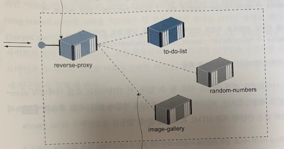
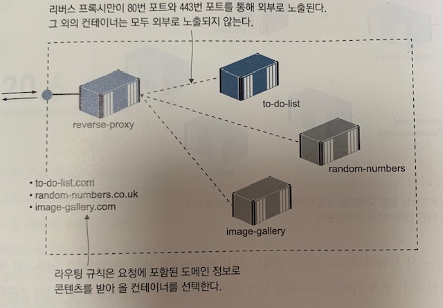
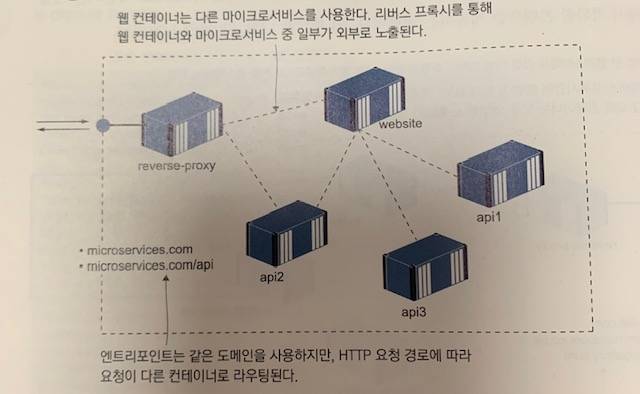
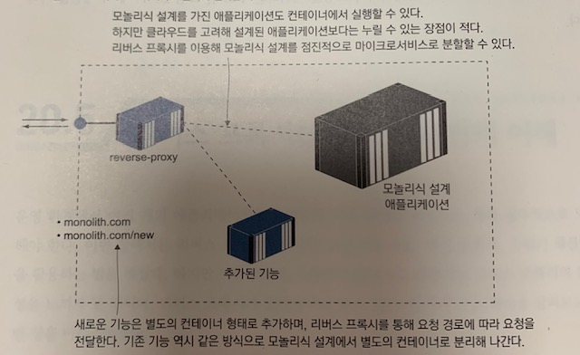

# 20장 리버스 프록시를 이용해 컨테이너 HTTP 트래픽 제어하기

## 리버스 프록시란?

### 프록시

네트워크에서 말하는 프록시는 **네트워크상의 다른 구성 요소를 대신해 네트워크 트래픽을 처리하는 네트워크 구성 요소**를 말한다. 예를들어 회사 네트워크에서 웹 브라우저에서 전달되는 요청을 가로채 허용된 사이트인지 확인하거나 빠른 속도를 위해 접근하려는 사이트의 캐시를 제공하는 용도로 사용한다.

### 리버스 프록시

여러 웹 애플리케이션으로 통하는 관문 역할을 하며, 모든 트래픽은 리버스 프록시를 거치며 해당 트래픽이 어떤 애플리케이션에서 출발한 것인지 판단한다. 또한, 애플리케이션의 응답 내용을 캐시해 두었다가 적절하게 가공해 클라이언트에게 전달하기도 한다.

리버스 프록시를 사용하면 모든 애플리케이션 컨테이너는 외부에 노출될 필요가 없다. 그만큼 스케일링, 업데이트, 보안 면에서 유리하다.



### nginx를 리버스 프록시로 사용하는 방법

nginx를 리버스 프록시로 사용하려면 사이트별 설정 파일을 하나 추가해야 한다. 같은 포트를 통해 여러 개의 애플리케이션을 호스팅하려면 이들을 먼저 구별할 수 있어야 하는데, 대개 도메인이 이 역할을 한다. 예를 들어, http://blog.sixeyed.com 에 접속을 시도하면 웹 브라우저가 보내는 HTTP 요청의 헤더에 `Host=blog.sixeyed.com` 이라는 정보가 들어간다. nginx는 이 헤더의 호스트 정보로 해당 요청을 처리할 사이트의 설정을 찾는다.

먼저 로컬 컴퓨터의 `hosts` 파일에 도메인을 추가하면 된다. 이 파일은 도메인과 IP 주소의 짝으로 이뤄진 간단한 파일로, nginx 컨테이너를 통해 여러 애플리케이션에 접근할 수 있게 해준다.

```sh
# 도메인 whoami.local을 hosts 파일에 추가
echo $'\n127.0.0.1 whoami.local' | sudo tee -a /etc/hosts
```

```yaml
# nginx docker-compose.yml 파일
version: '3.7'

services:
  nginx:
    image: diamol/nginx
    networks:
      ch20: {}
    ports:
    - published: 80
      target: 80
    - published: 443
      target: 443
    volumes:
    - source: ./nginx/certs
      target: /etc/nginx/certs
      type: bind
    - source: ./nginx/sites-enabled
      target: /etc/nginx/sites-enabled
      type: bind

networks:
  ch20:
    external: true
    name: ch20
```

```yaml
# whoami docker-compose.yml 파일
version: "3.7"

services:
  whoami:
    image: diamol/ch16-whoami
    networks:
      - ch20

networks:
  ch20:
    external:
      name: ch20
```

```sh
# nginx/sites-enabled 폴더 구조
nginx/sites-enabled
├── api.numbers.local
├── image-gallery.local
└── whoami.local
```

```sh
# nginx/sites-enabled/whoami.local
server {
    server_name whoami.local;										 # 도메인

    location / {
        proxy_pass             http://whoami; 	 # 콘텐츠가 위치한 주소
        proxy_set_header       Host $host;			 # 호스트 정보를 콘텐츠 위치로 설정
        add_header             X-Host $hostname; # 응답의 호스트 정보를 프록시 이름으로 변경
    }
}
```

리버스 프록시는 꼭 웹사이트만을 대상으로 하는 것은 아니며, HTTP로 제공되는 콘텐츠라면 무엇이든 대상이 될 수 있다. 당연히 REST API도 가능하며, 그 외 유형의 트래픽(일반 TCP/IP나 gRPC)도 가능한 경우가 있다.

이 설정의 효과는 엔진엑스가 단순히 요청을 전달하는 매개자 역할을 하는 것이다. 요청을 받을 때마다 이를 처리할 컨테이너('업스트림'이라고 한다)를 호출하고, 그 응답을 다시 클라이언트('다운스트림'이라고 한다)로 전달한다.

```sh
server {
    server_name api.numbers.local;									# 도메인

    location / {
        proxy_pass             http://numbers-api;	# 콘텐츠가 위치한 주소
        proxy_set_header       Host $host;					# 호스트 정보를 콘텐츠 위치로 설정
        add_header             X-Host $hostname;		# 응답의 호스트 정보를 프록시 이름으로 변경
    }
}
```

> ⚠️ nginx는 시작할 때 사이트별 설정 파일을 모두 읽은 다음 해당 설정의 업스트림이 모두 접근 가능한지 확인을 거치는데, 업스트림 중 하나라도 접근이 불가능한 것이 있다면 엔진엑스는 그대로 종료된다. 만약 nginx 설정 파일을 변경했다면 nginx 컨테이너를 재시작해야 한다. 

## 리버스 프록시의 라우팅과 SSL 적용하기

### 로드 밸런싱

nginx는 시작할 때 설정파일을 읽어 업스트림에 접근 가능한지 확인한 후, 모든 업스트림에 모두 접근이 가능하다면, 그 다음에는 호스트명과 IP 주소를 연결한 내부 라우팅 리스트를 만든다. 이 리스트가 프록시가 맡아 처리해 주는 첫 번째 인프라스트럭처 관련 사항이다. 만약 업스트림 컨테이너가 여러개 존재한다면 이들 간의 로드밸런싱까지 처리해 준다.

```sh
server {
    server_name image-gallery.local;											# 도메인

    location = /api/image {
        proxy_pass             http://iotd/image;					# 콘텐츠가 위치한 주소
        proxy_set_header       Host $host;								# 호스트 정보를 콘텐츠 위치로 설정
        add_header             X-Proxy $hostname;					# 응답 헤더에 업스트림 호스트명 추가
        add_header             X-Upstream $upstream_addr;	# 응답 헤더에 업스트림 IP 주소 추가
    }

    location / {
        proxy_pass             http://image-gallery;			# 콘텐츠가 위치한 주소
        proxy_set_header       Host $host;								# 호스트 정보를 콘텐츠 위치로 설정
        add_header             X-Proxy $hostname;         # 응답 헤더에 업스트림 호스트명 추가
        add_header             X-Upstream $upstream_addr;	# 응답 헤더에 업스트림 IP 주소 추가
    }        
}
```

### 라우팅

애플리케이션 스택의 일부분만 노출시키고 싶을 때 매우 유용한 패턴이며, 여러 개의 컴포넌트를 하나의 도메인 아래에 묶어 내고 싶을 때도 유용하다.

```sh
curl -i --head http://image-gallery.local			# 웹 애플리케이션으로 요청
curl -i http://image-gallery.local/api/image	# api 애플리케이션으로 요청
```

### SSL 적용

애플리케이션이 HTTPS 사이트로 돼 있다면 이를 위한 설정과 인증서가 어딘가에 위치해야 한다. 그리고 모든 애플리케이션 컴포넌트마다 따로 이를 두는 것보다는 중앙의 프록시에 두는 것이 훨씬 나을 것이다. nginx는 Let's Encrypt 같은 실제 도메인 제공자나 서비스에서 발급한 실제 인증서를 설정에 포함할 수 있다. 하지만 운영 외 환경에서는 자체 서명 인증서를 만들어 사용해도 된다.

```sh
# SSL이 포함된 사이트별 설정
server {
    server_name image-gallery.local;											# 도메인
    listen 80;
		return 301 https://$server_name$request_uri;
}

server {
	server_name  image-gallery.local;
	listen 443 ssl;

	ssl_certificate        /etc/nginx/certs/server-cert.pem;
	ssl_certificate_key    /etc/nginx/certs/server-key.pem;
	ssl_session_cache      shared:SSL:10m;
	ssl_session_timeout    20m;
	ssl_protocols          TLSv1 TLSv1.1 TLSv1.2;

	ssl_prefer_server_ciphers on;
	ssl_ciphers 'EECDH+AESGCM:EDH+AESGCM:AES256+EECDH:AES256+EDH';

	add_header  Strict-Transport-Security "max-age=31536000" always;

    location = /api/image {
        proxy_pass             http://iotd/image;						# 콘텐츠가 위치한 주소
        proxy_set_header       Host $host;									# 호스트 정보를 콘텐츠 위치로 설정
        add_header             X-Proxy $hostname;        		# 응답 헤더에 업스트림 호스트명 추가 
        add_header             X-Upstream $upstream_addr;		# 응답 헤더에 업스트림 IP 주소 추가
    }

    location / {
        proxy_pass             http://image-gallery;				# 콘텐츠가 위치한 주소
        proxy_set_header       Host $host;									# 호스트 정보를 콘텐츠 위치로 설정
        add_header             X-Proxy $hostname; 					# 응답 헤더에 업스트림 호스트명 추가         
        add_header             X-Upstream $upstream_addr;		# 응답 헤더에 업스트림 IP 주소 추가
    }        
}
```

### 캐싱 프록시

nginx는 고성능 HTTP 서버다. 정적 HTML 콘텐츠나 단일 페이지 애플리케이션을 제공하는데 활용할 수 있으며, 컨테이너 하나만으로도 초당 수천 건의 요청을 처리할 수 있다. 이러한 고성능 애플리케이션을 개선하는 데 활용하는 방법이 있다. 엔진엑스를 캐싱 프록시로 사용하는 방법이다.

캐싱 프록시란 업스트림 애플리케이션에서 받아 온 컨텐츠를 로컬 디스크나 메모리에 저장해 두었다가 이후 같은 콘텐츠에 대한 요청이 들어오면 업스트림에 콘텐츠를 요청하지 않고 저장된 것을 사용하는 것이다.

캐싱 프록시의 장점은 크게 두 가지다.

* 첫 번째는 요청을 처리하는 시간을 줄일 수 있다는 점이다. 애플리케이션이 아무리 빨리 요청을 처리하더라도 메모리에 미리 캐싱된 응답을 제공하는 것보다는 시간이 더 걸릴 수밖에 없다.
* 두 번째는 애플리케이션을 오가는 트래픽을 줄일 수 있으므로 그만큼 같은 인프라스트럭처로 더 많은 요청을 처리할 수 있다. 인증 쿠키가 포함된 요청을 캐싱하지 않도록 하면 개인화된 콘텐츠를 캐시에서 어렵지 않게 제외할 수 있다.

```sh
# SSL이 포함된 캐싱 프록시 설정
server {
    server_name image-gallery.local;															# 도메인
    listen 80;
		return 301 https://$server_name$request_uri;
}

server {
	server_name  image-gallery.local;
	listen 443 ssl;
    
    gzip  on;    
    gzip_proxied any;

	ssl_certificate        /etc/nginx/certs/server-cert.pem;
	ssl_certificate_key    /etc/nginx/certs/server-key.pem;
	ssl_session_cache      shared:SSL:10m;
	ssl_session_timeout    20m;
	ssl_protocols          TLSv1 TLSv1.1 TLSv1.2;

	ssl_prefer_server_ciphers on;
	ssl_ciphers 'EECDH+AESGCM:EDH+AESGCM:AES256+EECDH:AES256+EDH';

	add_header  Strict-Transport-Security "max-age=31536000" always;

    location = /api/image {
        proxy_pass             http://iotd/image;									# 콘텐츠가 위치한 주소
        proxy_set_header       Host $host;												# 호스트 정보를 콘텐츠 위치로 설정
        proxy_cache            SHORT;
        proxy_cache_valid      200  1m;														# 캐시 무효화 시간 (1분)
        add_header             X-Cache $upstream_cache_status;		# 응답 헤더에 캐시 상태 추가
        add_header             X-Proxy $hostname;         				# 응답 헤더에 업스트림 호스트명 추가
        add_header             X-Upstream $upstream_addr;					# 응답 헤더에 업스트림 IP 주소 추가
    }

    location / {
        proxy_pass             http://image-gallery;							# 콘텐츠가 위치한 주소
        proxy_set_header       Host $host;												# 호스트 정보를 콘텐츠 위치로 설정
        proxy_cache            LONG;
        proxy_cache_valid      200  6h;														# 캐시 무효화 시간 (1분)
        proxy_cache_use_stale  error timeout invalid_header updating
                               http_500 http_502 http_503 http_504; # 무효화된 캐시라도 사용
        add_header             X-Cache $upstream_cache_status;		# 응답 헤더에 캐시 상태 추가
        add_header             X-Proxy $hostname;									# 응답 헤더에 업스트림 호스트명 추가         
        add_header             X-Upstream $upstream_addr;					# 응답 헤더에 업스트림 IP 주소 추가
    }        
}
```

* `X-Cache` : 사용자 정의 응답 헤더인 `X-Cache` 를 사용하면 요청에 해당하는 캐시가 있는지 먼저 확인한다. 요청이 일치하는 캐시가 없다면, 응답 헤더에 이전에 같은 요청이 들어온 적이 없다는 의미인 `X-Cache: MISS` 가 나온다. 그리고 `X-Upstream` 헤더에 콘텐츠를 제공한 컨테이너의 IP 주소가 담긴다. 같은 요청을 반복하면, 그 다음 응답은 캐시에서 제공된다. 즉, 헤더에 `X-Cache: HIT` 가 있고 `X-Upstream` 이 없으므로 이를 알 수 없다.
* `proxy_cache_valid` : 이 설정에서 캐시의 유지 시간을 설정할 수 있다.
* `LONG` , `SHORT` : `diamol/nginx` 이미지의 nginx 코어 설정 파일에 정의된 것이다. 캐시 규격은 응답 콘텐츠를 저장하는 데 사용할 메모리 및 디스크 용량과 오래된 캐시 항목의 유효 시간을 설정한다.
* `proxy_cache_use_stale` : 이 항목은 업스트림을 사용할 수 없을 때 유효 시간이 만료된 캐시라도 사용하라는 의미다. 만료된 캐시 콘텐츠라도 제공할 수 있다면, 애플리케이션 컨테이너가 장애를 일으켜도 애플리케이션이 불완전하게나마 서비스를 제공할 수 있다. 캐시를 활용해 문제없이 서비스를 제공할 수 있는 경로를 세심히 골라야 하지만, 간단한 애플리케이션이라면 전체를 대상으로 해도 무방하다.

## 클라우드 네이티브 리버스 프록시

### 트래픽이란?

도커 엔진과 연결된 컨테이너는 이미지 푸시 외에도 도커 API의 애플리케이션 질의를 통해 다른 컨테이너에 대한 정보를 얻을 수 있다. 클라우드 네이티브 리버스 프록시 도구인 **트래픽(Traefik)**이 바로 이런 식으로 동작한다. 트래픽을 사용해 프록시를 적용하려면 애플리케이션별로 설정 파일을 따로 둘 필요 없이 컨테이너에 레이블을 추가하기만 하면 된다. 그러면 이 레이블을 이용해 스스로 설정과 라우팅 맵을 구성한다.

### 트래픽의 장점

* 트래픽 등과 같은 컨테이너용 프록시의 가장 큰 장점은 동적 설정을 구성할 수 있다는 점이다. 트래픽이 새로운 컨테이너를 모니터링하기 때문에 트래픽 실행 전에 모든 애플리케이션을 실행해 두지 않아도 된다.
* 또 애플리케이션 설정이 변경돼도 트래픽을 재시작할 필요가 없다.
* SSL 지원이 충실한데, 인증서 제공 서비스와 통합이 잘돼 있기 때문에 Let's Encrypt 서비스를 통해 자동으로 인증서가 갱신된다.
* 엔진엑스에서는 설정이 까다롭지만 트래픽에서는 [스티키 세션](https://kchanguk.tistory.com/146)을 쉽게 적용할 수 있다.

### 트래픽의 단점

* 트래픽의 경우, 캐시를 지원하지 않으므로 캐싱 프록시를 적용하려면 nginx를 사용해야 한다.


## 리버스 프록시를 활용한 패턴의 이해

리버스 프록시가 있어야 적용할 수 있는 세 가지 주요 패턴을 살펴보자.

* 첫 번째 패턴은 클라이언트 요청에 포함된 호스트명을 통해 HTTP 혹은 HTTPS로 제공되는 애플리케이션에서 적확한 콘텐츠를 제공하는 패턴이다.

  

* 두 번째 패턴은 한 애플리케이션이 여러 개의 컨테이너에 걸쳐 실행되는 마이크로서비스 아키텍처에서 주로 활용된다. 이 패턴에서 리버스 프록시는 HTTP 요청의 경로를 이용해 마이크로서비스의 요소 중 일부만을 선택적으로 노출한다. 외부에서 보면 애플리케이션은 하나의 도메인을 갖지만, 경로에 따라 서로 다른 컨테이너가 요청을 처리하는 구조다.

  

* 세 번째 패턴은 구식 모놀리식(monolithic) 설계를 가진 애플리케이션을 컨테이너로 이주시킬 때 특히 유용한 패턴이다. 먼저 리버스 프록시를 열어 두어 모돌리식 설계를 가진 애플리케이션의 프론트엔즈 역할을 맡긴다. 그리고 이후 추가되는 기능은 컨테이너로 분할한다. 이들 기능은 현대적인 기술 스택을 적용해 만들어졌으므로 리버스 프록시에서 라우팅을 통해 요청을 전달 받을 수 있다.

  
