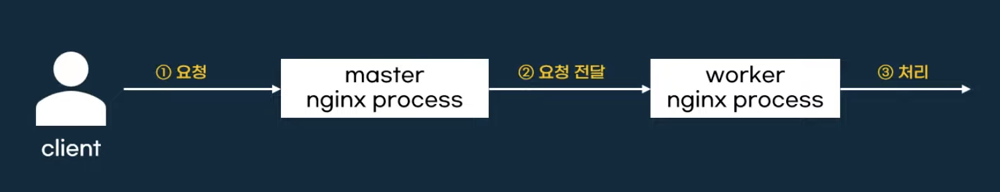
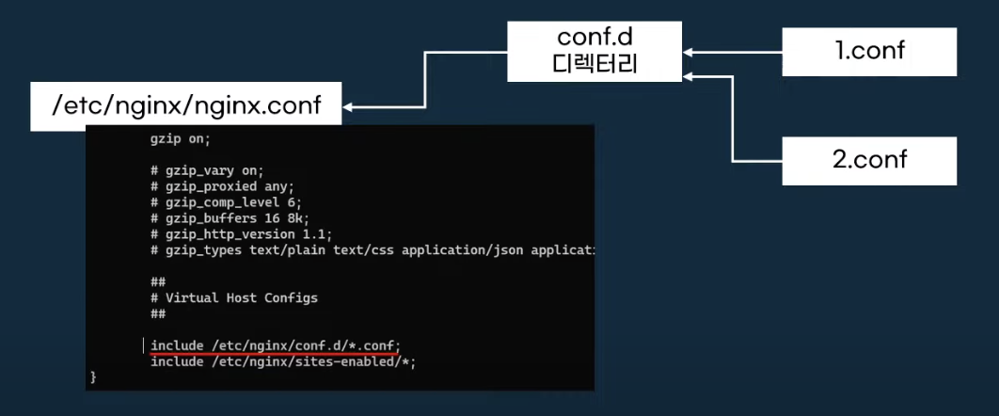
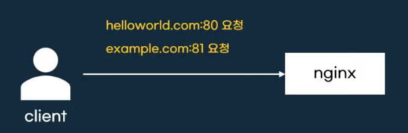
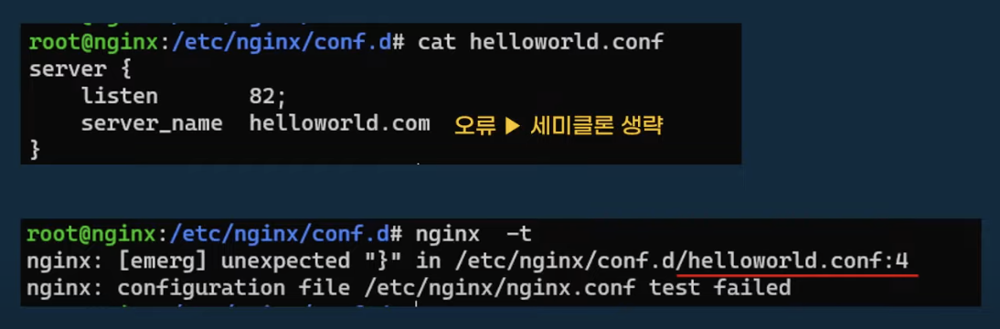
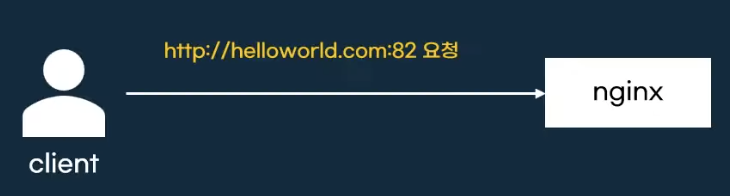
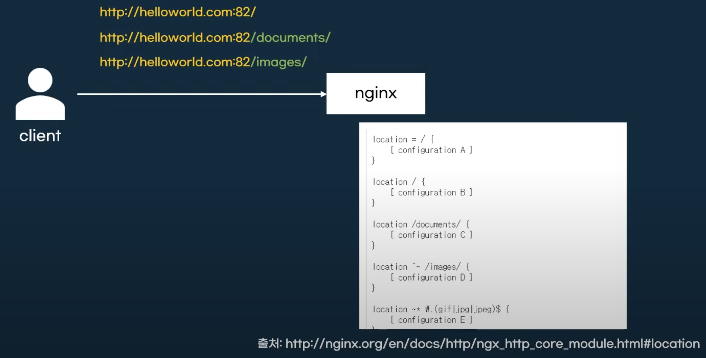
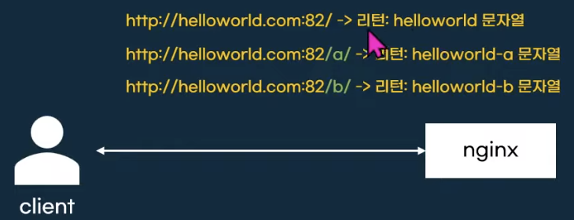
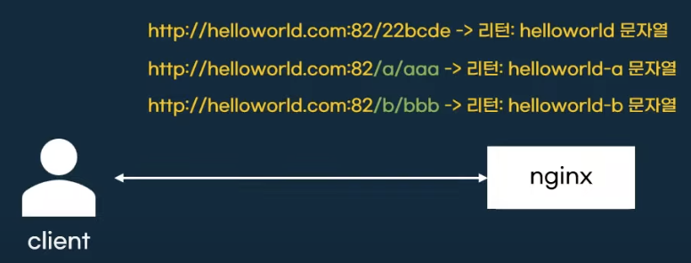
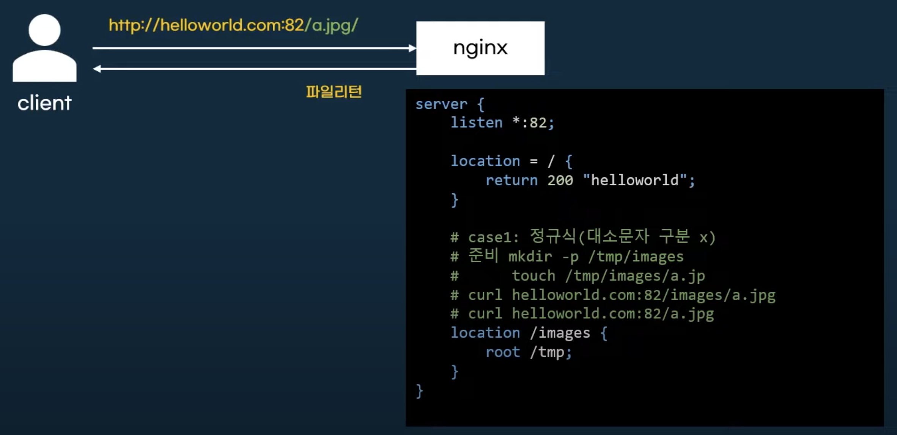
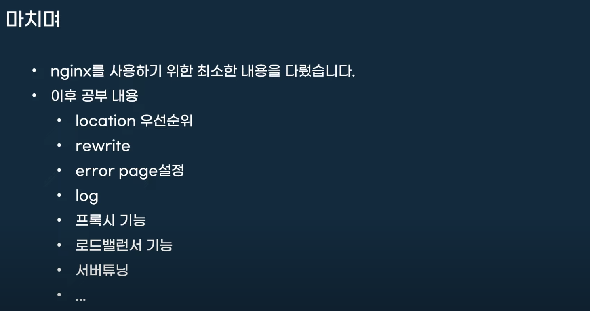

# Nginx 입문

## Nginx란?

* **많은 기능**을 수행하는 소프트웨어
  * 리버스 프록시, 로드밸런서, 캐시 등

### 마스터 프로세스와 워커 프로세스

* 마스터 프로세스와 워커 프로세스로 구성

  

* 마스터 프로세스와 워커 프로세스 확인법

  ```sh
  # 마스터 프로세스와 워커 프로세스 확인
  ps aux --forest | grep nginx | grep -v color
  
  > root@356ed75ed665:/# ps aux --forest | grep nginx | grep -v color
  > root       137  0.0  0.0   3324  1540 pts/0    S+   10:18   0:00  \_ grep nginx
  > root         1  0.0  0.0  11392  7260 ?        Ss   10:17   0:00 nginx: master process nginx -g daemon off;
  > nginx       30  0.0  0.0  11856  2864 ?        S    10:17   0:00 nginx: worker process
  > nginx       31  0.0  0.0  11856  2864 ?        S    10:17   0:00 nginx: worker process
  > nginx       32  0.0  0.0  11856  2864 ?        S    10:17   0:00 nginx: worker process
  > nginx       33  0.0  0.0  11856  2864 ?        S    10:17   0:00 nginx: worker process
  > nginx       34  0.0  0.0  11856  2864 ?        S    10:17   0:00 nginx: worker process
  > nginx       35  0.0  0.0  11856  2864 ?        S    10:17   0:00 nginx: worker process
  ```
  
  > ⚠️ Docker 컨테이너에서 `ps` 명령어가 실행되지 않는다면?
  >
  > * `ps` 패키지를 설치한다.
  >
  >   ```sh
  >   apt-get update && apt-get install -y procps
  >   ```
  >
  > * Docker Image에는 다음 인스트럭션을 추가한다.
  >
  >   ```dockerfile
  >   RUN apt-get update && apt-get install -y procps && rm -rf /var/lib/apt/lists/*
  >   ```

* 워커 프로세스 개수를 따로 설정하지 않으면 CPU 코어 개수에 따라 자동으로 설정되는데, 만약 개수를 조절하고 싶다면 `/etc/nginx/nginx.conf` 파일에서 설정할 수 있다.

  ```sh
  vi /etc/nginx/nginx.conf
  
  > user nginx;
  > worker_processes auto; # 워커 프로세스 개수 설정가능
  > 
  > error_log /var/log/nginx/error.log notice;
  > pid       /var/run/nginx.pid;
  
  # 개수 변경후 nginx 재시작
  systemctl restart nginx
  
  # 마스터 프로세스와 워커 프로세스 확인
  ps aux --forest | grep nginx | grep -v color
  ```

## 설정파일

* 설정파일은 `/etc/nginx/nginx.conf` 에 위치

* 설정파일은 디렉티브(directives)로 관리

  * 간단(simple) 디렉티브와 블럭 디렉티브로 분류 (블럭으로 감싸져 있으면 블럭 디렉티브, 안감싸져 있으면 simple 디렉티브)

    ```nginx
    server { # 블럭 디렉티브
      location { # 블럭 디렉티브
        root /data/www; # 심플 디렉티브
      }
      
      location /images/ { # 블럭 디렉티브
        root /data; # 심플 디렉티브
      }
    }
    ```

* 설정 끝은 세미콜론으로 표시

* `include` 를 사용해서 설정파일을 분리해서 관리

  


## Server block

* 서버 기능을 설정하는 블록

* 어떤 주소:포트로 요청을 받을지 결정

  

  ```nginx
  server {
    listen 80; # 어떤 포트로 받을 것인지 listen 디렉티브로 표기
    server_name example.org www.example.org; # 어떤 도메인으로 받을 것인지 server_name으로 표기
  }
  
  server {
    listen 80;
    server_name example.net www.example.net;
  }
  
  server {
    listen 80;
    server_name example.com www.example.com;
  }
  ```

* 기본적으로 `/etc/nginx/nginx.conf` 파일에는 `include /etc/nginx/conf.d/*.conf;` 디렉티브가 있기 때문에 `/etc/nginx/conf.d` 경로에 설정 파일을 생성하면 적용된다.

  ```nginx
  # /etc/nginx/conf.d/helloworld.conf
  server {
    listen 82;
    server_name helloworld.com;
  }
  ```

  ```sh
  # /etc/hosts
  # nginx server_name
  127.0.0.1 helloworld.com
  ```

  ```sh
  # nginx 재시작
  systemctl restart nginx
  
  # http 요청
  curl helloworld.com:82
  ```

## Nginx 문법 검사

* `nginx -t` 명령어는 nginx 설정파일이 문법에 맞게 작성 되었는지 검사

  

## Http block

* http 프로토콜 사용

  

  * server 블록을 사용하려면, 프로토콜 블록으로 감싸야 한다.

    ```nginx
    http {
      server {
        listen 82;
        server_name helloworld.com;
      }
    }
    ```

* 단, `/etc/nginx/conf.d` 경로에 작성한 설정파일은 `/etc/nginx/nginx.conf` 설정파일에서 http 블록 안에서 include 되기 때문에 따로 http 블록을 명시하지 않아도 된다.

  ```nginx
  # /etc/nginx/nginx.conf
  http {
    # ...
    include /etc/nginx/conf.d/*.conf;
  }
  ```

## location block

* 요청 URI를 분석하여 세부 설정

  

  

  ```nginx
  server {
    listen *:82;
    server_name helloworld.com;
  
    location / {
      return 200 "helloworld";
    }
  
    location /a/ {
      return 200 "helloworld-a";
    }
  
    location /a {
      return 200 "helloworld-a";
    }
  
    location /b/ {
      return 200 "helloworld-b";
    }
  
    location /b {
      return 200 "helloworld-b";
    }
  }
  ```

> VS Code에서 NGINX Configuration Language Support 익스텐션을 다운로드 받으면 문법 지원을 받을 수 있다.

* 기존설정 문제

  * prefix만 맞으면 뒤에 문자열이 있어도 동작

    

* 기존설정 문제 해결

  * exact match로 변경, location에 `=` 을 붙이면 된다.

    ```nginx
    server {
      listen *:82;
      server_name helloworld.com;
    
      location = / {
        return 200 "helloworld";
      }
    
      location = /a/ {
        return 200 "helloworld-a";
      }
    
      location = /a {
        return 200 "helloworld-a";
      }
    
      location = /b/ {
        return 200 "helloworld-b";
      }
    
      location = /b {
        return 200 "helloworld-b";
      }
    }
    ```


## file return

* 문자열이 아닌 파일을 리턴(html, png 등)

  

  * `root` 디렉티브를 사용한다.

## 마치며



## Proxy

```nginx
server {
  location / {
    proxy_set_header HOST $host;
    proxy_pass http://127.0.0.1:4060;
    proxy_redirect off;
  }
}
```

* [Docker Nginx Reverse Proxy 구성하기](https://velog.io/@shin6949/Nginx-Reverse-Proxy-%EA%B5%AC%EC%84%B1%ED%95%98%EA%B8%B0-feat.-Docker)

## HTTPS

### Let's Encrypt 사용

```sh
# certbot-auto 사용
wget https://dl.eff.org/certbot-auto
```


## Reference

* https://www.youtube.com/watch?v=hA0cxENGBQQ&t=191s
* https://velog.io/@shin6949/Nginx-Reverse-Proxy-%EA%B5%AC%EC%84%B1%ED%95%98%EA%B8%B0-feat.-Docker

