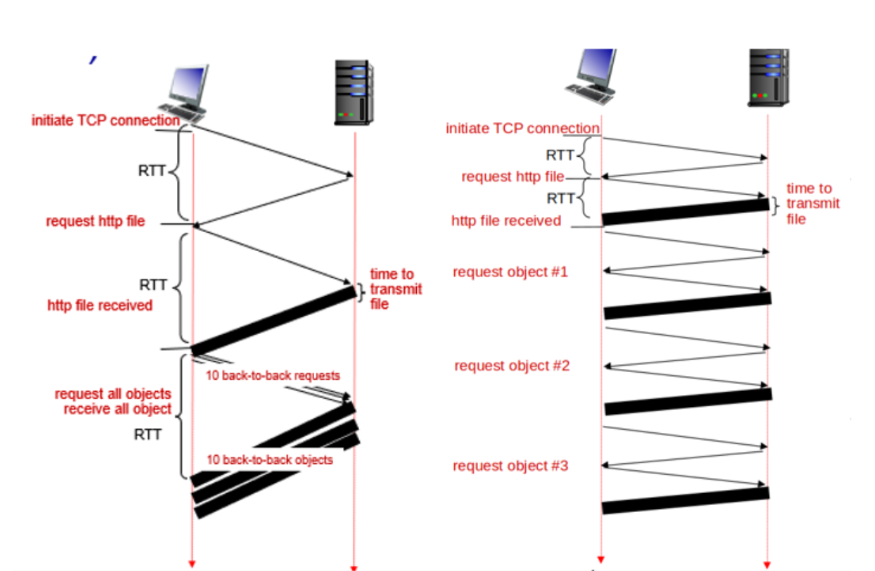
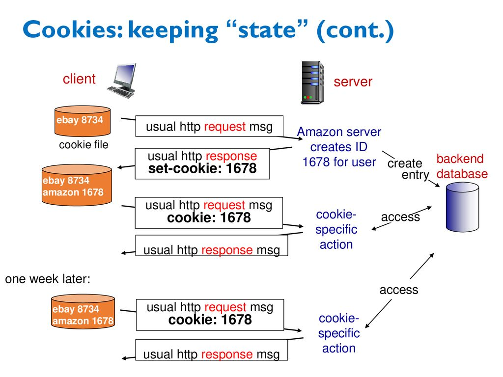

# CHAPTER 2 애플리케이션 계층

## 네트워크 애플리케이션

### 네트워크 애플리케이션이란?

운영체제 위에서 실행되는 하나의 **프로세스들이 다른 머신에 있는 프로세스와 메세지를 교환**하는 애플리케이션을 말한다.

### 네트워크 애플리케이션 구조

애플리케이션 구조를 선택할 때 애플리케이션 개발자는 현대 네트워크 애플리케이션에서 사용되는 두 가지 잘 알려진 **클라이언트-서버 구조** 혹은 **P2P 구조** 중 하나로 개발할 수 있다.

#### 클라이언트 서버 구조

항상 동작하고 있 호스트를 **서버**라 부르며, 서버는 **클라이언트**라는 다른 호스트들로부터 서비스 요청을 받는다. 이러한 클라이언트 서버 구조를 가진 대표적인 예로는 클라이언트 호스트에서 실행되는 브라우저에서 웹 서버로 서비스를 요청하는 **웹 애플리케이션**이 있다.

클라이언트-서버 구조의 특징은 **클라이언트는 서로 직접적으로 통신하지 않고**, **서버가 고정 IP 주소라는 잘 알려진 주소를 갖는다**는 점이다. 서버는 항상 동작하고 있으므로 서버 주소로 패킷을 보내서 언제든지 서버에 연결할 수 있다.


### 프로세스 간 통신

#### 클라이언트와 서버 프로세스

**프로세스는 종단 시스템에서 실행되는 프로그램**이며, **같은 머신에 있는 프로세스끼리 메세지를 교환**하기 위해 운영체제에서 파이프 같은 것을 제공해 주는데 이것을 **IPC(Inter Process Comunication)**라고 한다.

**서로 다른 머신에서의 프로세스**는 컴퓨터 **네트워크를 통한 메시지 교환으로 서로 통신**한다. 통신하는 프로세스 각 쌍에 대해 일반적으로 클라이언트의 프로세스와 서버의 프로세스 중 하나로 이름 짓는데, 웹에서 브라우저는 클라이언트 프로세스이고, 웹 서버는 서버 프로세스다. 

클라이언트와 서버 프로세스를 다음과 같이 정의할 수 있다. "**두 프로세스 간의 통신 세션에서 통신을 초기화(다른 프로세스와 세션을 시작하려고 접속을 초기화)하는 프로세스를 클라이언트**라 하고, **세션을 시작하기 위해 접속을 기다리는 프로세스를 서버**라고 한다."

#### 프로세스와 컴퓨터 네트워크 사이의 인터페이스

하나의 프로세스로부터 다른 프로세스로 보내는 메시지는 네트워크를 통해 움직인다. 프로세스는 **소켓**을 통해 네트워크로 메시지를 보내고 받는다.

**소켓**은 호스트의 애플리케이션 계층과 트랜스포트 계층 간의 인터페이스다. 또한 소켓은 네트워크 애플리케이션이 인터넷에 만든 프로그래밍 인터페이스이므로, 애플리케이션과 네트워크 사이의 API(Application Programming Interface)라고도 한다.

#### 프로세스 주소 배정

특정 목적지로 우편 메일을 보내기 위해서는 목적지가 주소를 갖고 있어야 하는 것처럼, 수신 프로세스를 식별하기 위해서 다음과 같은 두 가지 정보가 명시되어야 한다.

1. **호스트의 주소** : 인터넷에서 호스트는 32비트로 구성되며, 호스트를 유일하게 식별하는 **IP 주소**로 식별된다.
2. **수신 프로세스를 명시하는 식별자** : 메시지가 전달되어야 하는 호스트의 주소를 아는 것과 더불어 송신 호스트는 수신 호스트에서 수행되고 있는 수신 프로세스(좀 더 자세히는 수신 소켓)도 식별해야 한다. 이 정보는 일반적으로 한 호스트가 많은 네트워크 애플리케이션을 수행할 수 있기 때문이다. 목적지 **포트 번호**가 이 목적을 위해 사용된다. 또한 인기 있는 애플리케이션은 특정한 포트 번호가 할당된다. (웹 서버는 포트 번호 80번, (SMTP 프로토콜을 사용하는) 메일 서버는 포트 번호 25번)


### 애플리케이션이 이용 가능한 트랜스포트 서비스

트랜스포트 계층 프로토콜이 애플리케이션들에게 제공할 수 있는 서비스는 무엇인가? 가능한 서비스들을 넓은 범위에서 **신뢰적 데이터 전송**, **처리율**, **시간**, **보안**이라는 네 가지 차원으로 분류할 수 있다.

#### 신뢰적 데이터 전송

패킷들은 컴퓨터 네트워크 내에서 손실될 수 있다. 따라서 이러한 애플리케이션을 지원하기 위해 **한 애플리케이션이 보낸 데이터가 올바르고 완전히 다른 애플리케이션에 전달되도록 보장**하기 위해 무엇인가 조치를 취해야 한다. 만약 프로토콜이 보장된 데이터 전송 서비스를 제공한다면 이를 신뢰적 전송(reliable data transfer)을 제공한다고 한다.

트랜스포트 계층 프로토콜이 신뢰적 데이터 전송을 제공하지 않을 때, 송신 프로세스가 보낸 데이터는 수신 프로세스에 전혀 도착하지 않을 수 있다. 이것은 손실 허용 애플리케이션(loss-tolerant application)의 경우, 즉 어느 정도의 데이터 손실을 참아낼 수 있는 실시간 오디오/비디오 혹은 저장 비디오/오디오 같은 멀티미디어 애플리케이션에서는 받아들여질 수 있다.

#### 처리율

**어느 명시된 속도에서 보장된 가용 처리율을 제공**하는 것이다. 그러한 서비스로 애플리케이션을 r비트/초의 보장된 처리율을 요구할 수 있고 트랜스포트 프로토콜은 가용한 처리율이 항상 적어도 r bps임을 보장한다.

처리율 요구사항을 갖는 애플리케이션은 대역폭 민감 애플리케이션(bandwidth-sensitive application)이라고 한다. 대역폭 민감 애플리케이션들이 특정 처리율 요구사항을 갖고 있는 반면에, 탄력적 애플리케이션(elastic application)은 가용한 처리율을 많으면 많은 대로 적으면 적은 대로 이용할 수 있다. 전자메일, 파일 전송, 웹 전송이 융통성 있는 애플리케이션이다.

#### 시간

트랜스포트 계층 프로토콜은 또한 **시간 보장(timing guarantee)을 제공**할 수 있다. 처리율 보장과 마찬가지로 시간 보장은 여러 가지 형태로 나타난다. 한 가지 예는 송신자가 소켓으로 내보내는 모든 비트가 수신자의 소켓에 100ms 내에 도착하게 하는 것이다. 이렇게 **지연**이 낮은 것은 인터넷 전화, 가상 환경, 원격회의, 다자간 게임과 같은 실시간 상호작용 애플리케이션에 매력적이다. 비실시간 애플리케이션의 경우 낮은 지연이 항상 높은 지연보다 선호되지만 종단 간 지연에 엄격한 제약을 받는 것은 아니다.

#### 보안

마지막으로, 트랜스포트 프로토콜은 애플리케이션에 하나 이상의 보안 서비스를 제공할 수 있다. 예를 들어, 송신 호스트에서 트랜스포트 프로토콜은 송신 프로세스가 전송하는 모든 데이터를 암호화할 수 있고 수신 호스트에서 트랜스포트 프로토콜은 그 데이터를 수신 프로세스로 전달하기 전에 데이터의 암호를 해독할 수 있다. 그러한 서비스는 데이터가 송신과 수신 프로세스 사이에서 어느 정도 관찰된다 하더라도 두 프로세스 사이에 기밀성을 제공한다. 또한 트랜스포트 프로토콜은 기밀성(confidentiality) 외에도 다른 보안 서비스를 제공하는데, 무결성(integrity)과 종단 인증(authentication) 등이 포함된다.


### 인터넷 전송 프로토콜이 제공하는 서비스

지금까지는 컴퓨터 네트워크가 일반적으로 제공할 수 있는 트랜스포트 서비스를 고려했다. 이제 좀 더 세부적으로 들어가서 인터넷이 제공하는 애플리케이션 지원 유형을 살펴보자. 인터넷(그리고 일반적인 TCP/IP 네트워크)은 애플리케이션에게 2개의 전송 프로토콜, 즉 **UDP(User Datagram Protocol)**와 **TCP(Transmission Control Protocol)**를 제공한다.

#### TCP 서비스

TCP 서비스 모델은 연결지향형 서비스와 신뢰적인 데이터 전송 서비스를 포함한다. 애플리케이션이 TCP 전송 프로토콜을 사용하면, 애플리케이션은 TCP로부터 이 두 가지 서비스를 받는다.

* **연결지향형 서비스**: **애플리케이션 계층 메시지를 전송하기 전에 TCP는 클라이언트와 서버가 서로 전송 제어 정보를 교환**하게 한다. 이 핸드셰이킹 과정이 클라이언트와 서버에 패킷이 곧 도달할 테니 준비하라고 알려주는 역할을 한다. 핸드셰이킹 단계를 지나면, TCP 연결이 두 프로세스의 소켓 사이에 존재한다고 말한다. 이 연결은 두 프로세스가 서로에게 동시에 메시지를 보낼 수 있기에 전이중(full-duplex) 연결이라고 한다. 애플리케이션이 메시지 전송을 마치면 연결을 끊어야 한다.
* **신뢰적인 데이터 전송 서비스**: 통신 프로세스는 **모든 데이터를 오류 없이 올바른 순서로 전달**하기 위해 TCP에 의존한다. TCP는 애플리케이션의 한쪽이 바이트 스트림을 소켓으로 전달하면 그 바이트 스트림이 손실되거나 중복되지 않게 수신 소켓으로 전달한다.
* **혼잡 제어 방식**: **통신하는 프로세스의 직접 이득보다는 인터넷의 전체 성능 향상을 위한 서비스**를 포함한다. TCP 혼잡 제어 방식은 네트워크가 혼잡 상태에 이르면 프로세스(클라이언트 또는 서버) 속도를 낮춘다. 특히 TCP 혼잡 제어는 각 TCP 연결이 네트워크 대역폭을 공평하게 공유할 수 있게끔 제한하려고 시도한다.

#### UDP 서비스

UDP는 최소의 서비스 모델을 가진 간단한 전송 프로토콜이다.

* **비연결형 서비스** : **두 프로세스가 통신을 하기 전에 핸드셰이킹을 하지 않는다**.
* **비신뢰적인 데이터 전송 서비스** : 하나의 프로세스가 UDP 소켓으로 메시지를 보내면, UDP는 그 메시지가 수신 소켓에 도착하는 것을 보장하지 않는다. 게다가 수신 소켓에 도착하는 메시지들의 순서가 뒤바뀔 수도 있다.
* **혼잡 제어 방식을 포함하지 않음** : UDP의 송신 측은 데이터를 원하는 속도로 하위 계층(네트워크 계층)으로 보낼 수 있다.


## 웹과 HTTP

### HTTP 개요

HTTP(HyperText Transfer Protocol)는 웹 클라이언트가 웹 서버에게 웹 페이지를 어떻게 요청하는지와 서버가 클라이언트로 어떻게 웹 페이지를 전송하는지를 정의한다. 사용자가 웹 페이지를 **요청**할 때, 브라우저는 페이지 내부의 객체에 대한 HTTP 요청 메시지를 서버에게 보낸다. 서버는 요청을 수신하고 객체를 포함하는 HTTP 응답 메시지로 **응답**한다.

#### HTTP 전송 프로토콜

HTTP는 TCP를 전송 프로토콜로 사용한다.

1. HTTP 클라이언트는 먼저 서버에 TCP 연결을 시작한다.
2. 일단 연결이 이루어지면, 브라우저와 서버 프로세스는 그들의 소켓 인터페이스를 통해 TCP로 접속한다. 클라이언트는 HTTP 요청 메시지를 소켓 인터페이스로 보내고 소켓 인터페이스로부터 HTTP 응답 메시지를 받는다. 마찬가지로, HTTP 서버는 소켓 인터페이스로부터 요청 메시지를 받고 응답 메시지를 소켓 인터페이스로 보낸다.

#### 비상태 프로토콜 (stateless protocol)

서버가 클라이언트에게 요청 파일을 보낼 때, **서버는 클라이언트에 관한 어떠한 상태 정보도 저장하지 않는다**. 만약 특정 클라이언트가 몇 초 후에 같은 객체를 두 번 요청한다면, 잠시 전에 이미 그 객체를 보냈다고 서버가 알려주면 좋겠지만 서버는 이전에 한 일을 기억하지 않으므로 그 객체를 또 보낸다. HTTP 서버는 클라이언트에 대한 정보를 유지하지 않으므로, HTTP를 비상태 프로토콜(stateless protocol)이라고 한다.

### 비지속 연결과 지속 연결

비지속 연결(Non-persistent connection)은 객체(object)에 대한 요청을 할 때 매번 TCP 연결을 새롭게 하는 것을 말하고, 지속 연결 (persistent connection)은 여러개에 객체(object)에 대해 한 번의 TCP 연결만 하는 것을 말한다.



#### 비지속 연결 HTTP

* RTT (definition) : time for small packet to travel from client to server and back
* HTTP response time:
  * one RTT to initiate TCP connection
  * one RTT for HTTP request and first few bytes of HTTP response to return
  * file transmission time
  * Non-persistent HTTP response time = 2RTT + file transmission time

#### 지속 연결 HTTP

* Non-persistent HTTP Issues :
  * requires 2 RTTs per object
  * OS overhead for each TCP connection
  * browsers often open parallel TCP connections to fetch referenced objects
* persistent HTTP :
  * server leaves connection open after sending response
  * subsequent HTTP messages between same client/server sent over open conneciton
  * Client sends requests as soon as it encounters a referenced object
  * as little as on RTT for all the referenced objects

### HTTP 메시지 포맷

HTTP 메세지는 **HTTP 요청 메세지**와 **HTTP 응답 메세지** 두 가지가 있다.

#### HTTP 요청 메시지

```
// request header
GET /index.html HTTP/1.1\r\n
```

#### HTTP 응답 메시지

```
// response header
HTTP/1.1 200 OK\r\n
```

### 사용자와 서버 간의 상호작용: 쿠키

쿠키는 stateless를 보완하기 위해 나온 trick이다.


